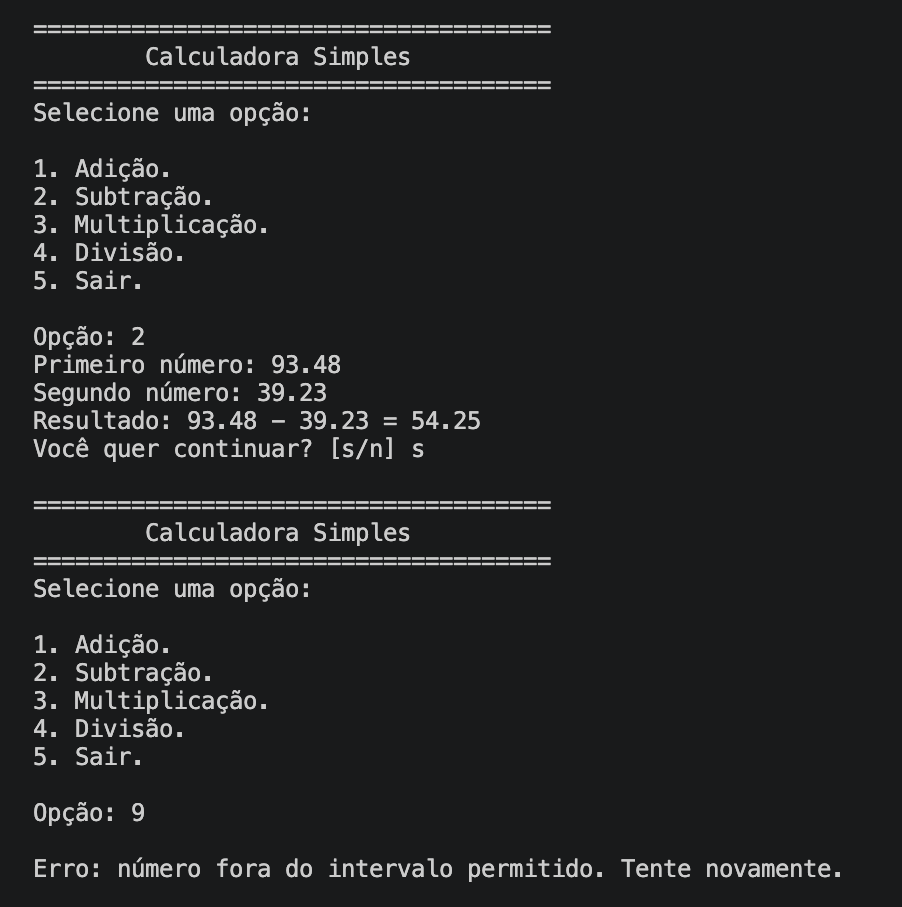
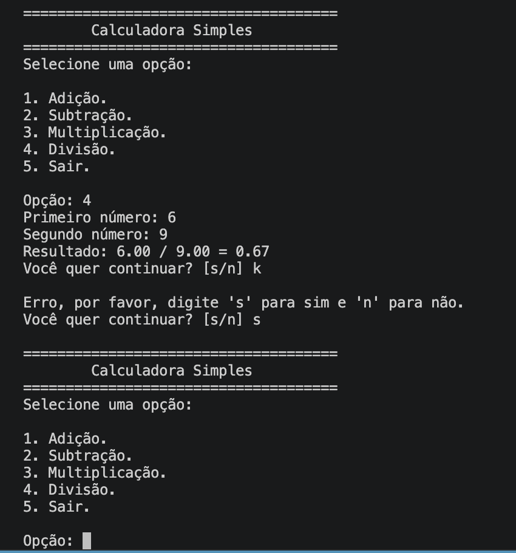

# calculadora-em-texto

### Descrição

Uma calculadora que funciona inteiramente no terminal, com as quatro operações fundamentais da aritmética (adição, subtração, multiplicação e divisão). Após cada cálculo, o programa oferece a oportunidade do usuário fazer outras contas sem precisar rodar ele novamente, mostrando um menu de cinco opções, um para cada operação e outro para sair do programa. Reconhece entradas inválidas e deixa o usuário inserir novamente até ele escrever uma entrada válida. Dessa forma, a calculadora se torna algo prático no dia a dia. Cada cálculo é realizado com duas casas de precisão.

### Capturas de tela

<p align="center">
  
  
</p>

### Pré-requisitos

Para conseguir rodar o programa, basta um editor de código como o Visual Studio Code e um compilador de linguagem C. Após isso, crie um arquivo .c e passe o código para ele.

### Usos e exemplos

Ao iniciar o programa, aparecerá um menu inicial com cinco opções:

1. Adição
2. Subtração
3. Multiplicação
4. Divisão
5. Sair

E pede para o usuário digitar uma opção. Caso ele não digite um número dentro do intervalo, aparece uma mensagem de erro que pede para o usuário tentar novamente. Quando ele digitar uma entrada válida, se ele digitar a opção 5, o programa manda uma mensagem de despedida e encerra, e se ele digitar outras opções, o programa pedirá dois números. O programa verifica se o usuário digitou números não-negativos e realiza a conta. Caso o usuário tiver pedido uma divisão, mas escrever 0 como segundo número, aparece uma mensagem de erro: "Erro: divisão por zero não é permitida.". 

Após cada cálculo, o programa pergunta se o usuário quer continuar, verifica se a resposta foi positiva ou negativa, se não foi nenhum desses, aparece uma mensagem de erro. Se for negativa, o programa manda uma mensagem de despedida e encerra, caso contrário, aparece o menu inicial novamente.

Assim como toda calculadora, ela é prática para realizar contas básicas rapidamente.

### Estrutura do projeto
    
```
calculadora-em-texto-baseada-em-c/  
│── main.c
│── LICENSE.md
│── README.md  
└── imagens/  
    ├── Demonstração1.png
    └── Demonstração2.png  
```

O arquivo main.c contém todo o código da calculadora, LICENSE.md contém a licença e o diretório imagens/ contém fotos de demonstrações do uso do programa.

## Licença  

Este projeto está licenciado sob a MIT License - veja o arquivo [LICENSE](LICENSE) para mais detalhes.  
